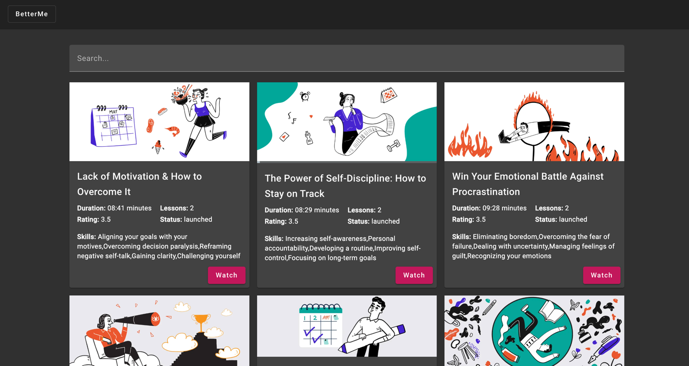
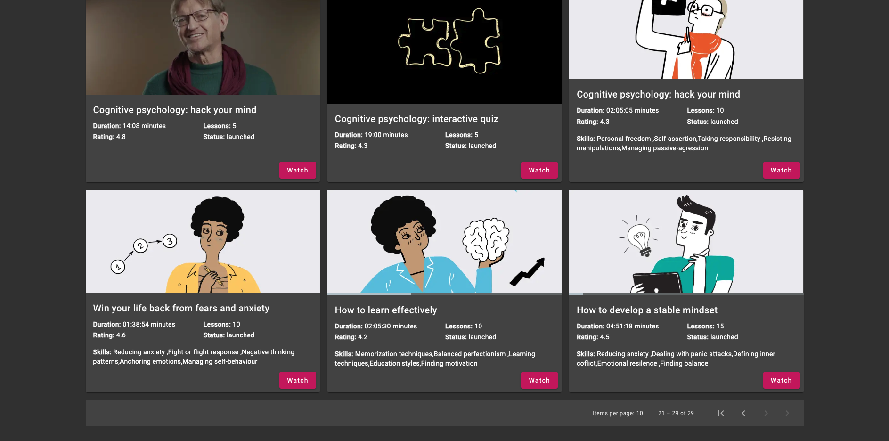
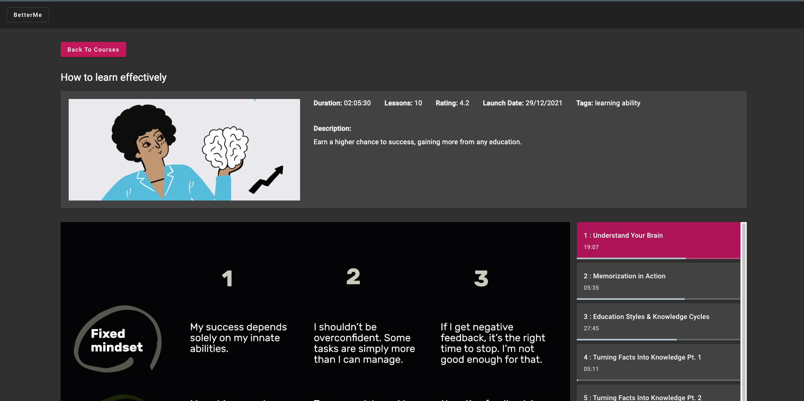

# BetterMe - designed to provide you with the knowledge and skills necessary to improve yourself and your life.
The application is built using the Angular framework and Angular Material

## To get started with the application, simply clone the repository to your local machine and follow the instructions;
- Run `ng serve` or `npm run start` for a dev server. Navigate to `http://localhost:4200/`
- Run `ng test` or `npm run test` to execute the unit tests;

## Courses Page

---

## Single Course

